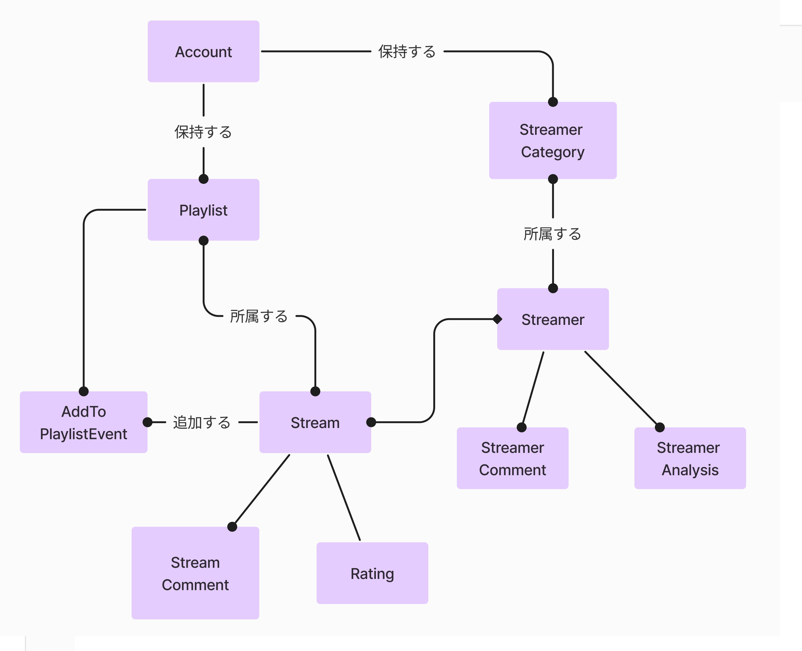

# Stream Channel Backend

## プロジェクト概要

Stream Channel は、YouTube や Twitch などの動画配信プラットフォームを横断して、ユーザーが好きな配信者や動画を管理・共有できる Web アプリケーションです。このリポジトリは、Stream Channel のバックエンド部分を実装しています。

## 技術スタック

- 言語: TypeScript
- フレームワーク: Express.js
- データベース: PostgreSQL
- ORM: Prisma
- 認証: JWT
- テスト: curl, Jest, supertest(deploy のみ)
- コンテナ化: Docker
- CI/CD とデプロイ: Render
- ノートテイキング：マークダウン


## 開発プロセス

### 1. 要件定義

プロジェクトの初期段階で、以下の主要機能を定義しました：

- ユーザー認証（通常アカウントとゲストアカウント）
- 複数プラットフォームからの配信者・動画情報の表示
- 他のユーザーが共有したストリーマーカテゴリ、プレイリストの表示
- プレイリスト管理・共有機能
- ストリーマーカテゴリ管理・共有機能
- 配信と配信者に対する評価・コメント機能
- 配信者の分析を投稿し、表示する機能

[ユースケース駆動開発実践ガイド](https://www.shoeisha.co.jp/book/detail/9784798114453) という本を読み、 ICONIX プロセスというものを学んだので、機能からドメインモデルを定義しました。以下のドメインモデルはプロジェクトの初期に定義したものなので、 開発プロセスが進むにつれて、更新されています。


各機能について、定義したドメインモデルの用語を使って、以下のようにユースケースを記述していきました。このユースケーステキストに基づいて、設計を進めていきます。

```

[アカウントを開く]
ユーザーが画面の「Sign Up」ボタンをクリックすると、システムはアカウント登録画面を表示する。ユーザーはそこにメールアドレスとパスワードを入力して、「Proceed」を押す。するとシステムはユーザーが入力した情報を検証し、それをデータベースに登録する。その後、システムは登録完了メッセージを表示し、トップページを再び表示する。

代替フロー
ユーザーが不正なメールアドレスを入力した場合：
システムは画面上で不正な値であることをエラーメッセージを表示し、ユーザーにメールアドレスの再入力を促す。ユーザーはそれを見て正しいメールアドレスを入力する。システムはその値を再び検証し、正当な値だった場合はメインフローに。

ユーザーが弱いパスワードを入力した場合：
システムは画面上でパスワード強度が不足していることを示すメッセージを表示し、ユーザーにより強力なパスワードの入力を促す。ユーザーは新しいパスワードを入力し、正当な値であればメインフローに戻る。

[好きな配信者の配信を追う]
ユーザーがアカウント登録を済ませていて、お気に入りの配信者を登録している場合、システムはそのユーザーが登録している配信者の配信を、最も新しいものから順番にトップページに表示する。

代替コース：ユーザーがまだアカウントを登録していない場合、システムは「アカウントを登録してください」というメッセージを表示
代替コース：ユーザーが配信者を登録していない場合、システムは「配信者を登録しよう」というメッセージと、他のユーザーが登録した配信者のリストを表示する

[プレイリストを共有する]
ユーザーは「プレイリストを共有する」ボタンを押すと、システムはユーザーが今までに作成したプレイリストを提示する。ユーザーは共有したいプレイリストを選んで、「共有する」を押す。するとシステムはそのプレイリストを共有状態にして、トップページの「みんなが見ているプレイリスト」の欄などで表示する。システムは非 public 状態のプレイリストは表示しない。
```

### 2. API設計

[The Design of Web APIs](https://www.manning.com/books/the-design-of-web-apis) という本を読んだので、この本の中に書かれている「API Goal Canvas」という方法を使って RESTful API をデザインしました。

API Goal Canvas とは、以下のようにまず API で必要になるリソースを特定し、そのリソースに対する操作を整理し、API への設計へとつなげていく手法です。リソースとリソースに対する操作を特定したら、それらを API のパスや HTTP のメソッドに変換し、その入出力を洗い出していくことで、API のエンドポイントを設計します。

リソースとその操作

リソース間の関係を整理


これらの作業はユースケーステキストをもとに行いました。

そして、整理したリソース、リソースへの操作、操作するときの入出力を以下のような表にまとめて、API のエンドポイント設計を行いました。


主要なエンドポイントには以下のようなものがあります：

- `/api/accounts`: アカウント作成
- `/api/login`: ログイン
- `/api/guest-login`: ゲストログイン
- `/api/streams/{stream_id}`: 配信情報の取得
- `/api/categories`: カテゴリの作成・取得
- `/api/playlists`: プレイリストの作成・取得


そして OpenAPI (Swagger) を使用し、`openapi.yaml` ファイルに設計したエンドポイントの仕様を記述しました。

ICONIX プロセスでは、ユースケース記述とドメインモデルからロバストネス図、シーケンス図を描いて詳細設計につなげる事になっているのですが、早く実装に移るため、ユースケースから直接 API/UI/DB 設計に移行しました。

### 3. データベース設計

まず、ユースケーステキストを見ながら、システムで使われるエンティティを抽出しました。（概念設計）



先端に黒い丸（●）がついている関係は 1対多 の関係を表しており、先端にひし形（◆）がついている関係は独立関係を表しています。

<br>

次にテーブルの論理設計を行いました。

ユースケースや UI/API 設計の結果からエンティティの使われ方を想像し、エンティティの属性を定義しました。

エンティティの主キーを特定し、依存関係のあるエンティティには外部キーをもたせました。


多対多の関係を持つエンティティ（Playlist と Stream, StreamerCategory と Streamer）があったので、中間テーブル（Stream_Playlist_Relation, Streamer_Category_Relation）を導入して、一対多の関係に分解しました。

プレイリスト中の配信を新しい順、古い順に並び替える機能を実現するため、 Stream_Playlist_Relation には added_at 属性をもたせました。

Stream の再生回数やタグを閲覧する機能がありますが、 これらは時間とともに変化するので、DB に永続化するのではなく、 必要になるたびに youtube/twitch API から取得することにしています。

正規化によるテーブル分割は、ほぼ必要ありませんでした。

データベースは PostgresSQL、ORM には Prisma を使用し、`schema.prisma` ファイルにモデルを定義しました。主要なモデルには以下のようなものがあります：

```prisma
model Account {
  user_id             String              @id @default(uuid()) @unique
  email               String              @unique
  password_hash       String
  is_guest            Boolean             @default(false)
  playlist            Playlist[]
  streamer_category   StreamerCategory[]
}

model Playlist {
  playlist_id               Int      @id @default(autoincrement()) @unique
  playlist_title            String   @db.VarChar(255)
  shared                    Boolean  @default(false)
  user_id                   String
  stream_playlist_relation  StreamPlaylistRelation[]
  account                   Account  @relation(fields: [user_id], references: [user_id])
}

model StreamerCategory {
  category_id                 Int      @id @default(autoincrement()) @unique
  category_title              String   @db.VarChar(255)
  shared                      Boolean  @default(false)
  user_id                     String
  streamer_category_relation  StreamerCategoryRelation[]
  account                     Account  @relation(fields: [user_id], references: [user_id])
}
```

外部キーを持つモデルは、必ず @relation を用いて参照関係を定義する必要があった。一対多の関係を持つモデルに関しては、「一」側のモデルにはリストフィールド（[]）を定義し、「多」側のモデルに外部キーフィールドを定義する必要があった。

Account の主キー user_id に autoincrement() を使っていると user_id を特定できてしまうので、 uuid() を使うようにしました。

### 4. 環境構築

開発環境の構築には Docker を使用し、アプリケーションとデータベースを分離して管理できるようにしました。これにより、開発環境と本番環境の差異を最小限に抑え、 開発環境の再現性を高めることができました。

Docker 環境の構築は、以下の手順で行いました
- 1.手動でコンテナを起動し、 開発環境に必要なファイル、コマンド、設定を洗い出す
- 2.手動で構築した環境を Dockerfile 化し、Docker CLI のコマンドでコンテナを構築できるようにする
- 3.docker-compose.yaml を記述し、 docker compose build でコンテナ群を起動できるようにする

### 4.1. 手動で環境構築
- node:20.12 イメージ を選び、 docker container run --tty --interactive --name be-experiments node:20.12 bash で起動
- npm install で TypeScript と express, @types/node @types/express をインストール
- 設定ファイルを編集するために、 vim をインストールし、 Winodws からコピペできるように /~ 以下に .vimrc を作成
- tsc --init で tsconfig.json が生成されるので vim で編集。
- コードがコンパイル＆実行できることを確認するために、src/index.ts に適当なコードを作成し、 tsc でコンパイルて node dist/index.js で実行。

```json
//tsconfig.json
{
  "compilerOptions": {
    "target": "es5",
    "module": "commonjs",
    "outDir": "./dist",
    "strict": true,
    "esModuleInterop": true,
    "skipLibCheck": true,
    "forceConsistentCasingInFileNames": true
  },
  "include": [
    "src/**/*.ts"
  ],
  "exclude": [
    "node_modules"
  ]
}
```

<br>

- 次に jest をインストールします。npm install で jest @types/jest ts-jest をインストール
- jest.config.js を記述し、package.json の scripts に "test": "jest" を追加
- 適当なコードを src/app.ts に作成し、__test__/app.test.ts にテストコードを作成して、 npm test でテストに通ることを確認


```js
//jest.config.js
module.exports = {
  preset: 'ts-jest',
  testEnvironment: 'node',
  testMatch: ['**/__tests__/**/*.test.ts'],
  transform: {
    '^.+\\.tsx?$': 'ts-jest',
  },
  moduleNameMapper: {
    '^@/(.*)$': '<rootDir>/src/$1',
  },
  moduleFileExtensions: ['ts', 'tsx', 'js', 'jsx', 'json', 'node'],
};
```

<br>

- 次に、DB コンテナを構築し、 DB に接続するためのアプリケーション側のセットアップをします。

- アプリケーション側のセットアップ
  - npm install prisma で Prisma をインストールし
  - npx prisma init を実行して schema.prisma を生成する
  - .env に Postgres で使用するパスワード、ユーザー名、データベース名を定義し、それらの値から生成される DATABASE_URL を定義
  - schema.prisma を編集し、データベースのテストに必要な最低限の設定をする
  - npx prisma generate を実行し、Prisma クライアントを生成
- Docker ネットワークの作成
  - docker network create \<network-name> でネットワークを作成
  - docker network connect my-network \<application-container-name> でアプリケーションコンテナをこのネットワークに参加させる
- PostgreSQL 側のセットアップ
  - イメージは postgres:16.2 を使用
  - docker container run --name \<db-container-name> --network \<network-name> -e POSTGRES_PASSWORD=\<password> -e POSTGRES_USER=\<username> -e POSTGRES_DB=\<db-name> -d postgres:16.2 を実行して、作成したネットワークに参加させた状態で DB コンテナを起動

```
generator client {
  provider = "prisma-client-js"
}

datasource db {
  provider = "postgresql"
  url      = env("DATABASE_URL")
}

//テスト用に適当なデータモデルを定義
model User {
  id        Int      @id @default(autoincrement())
  username  String   @unique
  email     String   @unique
  createdAt DateTime @default(now())
}
```

- ここまでのセットアップをしたうえで、 アプリケーションコンテナに入り、npx prisma migrate dev --name init を実行し、初期化マイグレーションを行う。
- src/db.ts に Postgres に接続できることを確かめるための適当なコードを作成する。
- __tests__/db.test.ts にそのテストコードを作成。
- npm test  db.test.ts を実行して、アプリケーションから DB に接続できることを確認した。

### 4.2. Dockerfile で構築
手動で構築した環境を Dockerfile 化します。以下のような Dockerfile を /docker/app/Dockerfile に作成しました。

```dockerfile
FROM node:20.12

RUN npm install -g typescript
WORKDIR /stream-channel-be
RUN npm install typescript express @types/node @types/express jest @types/jest ts-jest supertest @types/supertest
RUN npm install bcrypt jsonwebtoken cors dotenv @types/jsonwebtoken @types/bcrypt @types/cors

# ビルドコンテキストをルートに設定
COPY tsconfig.json  /stream-channel-be/
COPY package.json /stream-channel-be/
COPY jest.config.js /stream-channel-be/

# 後に src, __tests__ の内容をバインドマウントする
RUN mkdir src __tests__

# prisma 関係
RUN npm install prisma
RUN npx prisma init
COPY schema.prisma /stream-channel-be/prisma/
COPY .env /stream-channel-be/
RUN npx prisma generate
```

この Dockerfile から docker image build --tag stream-channel:app -f ./docker/app/Dockerfile . でカスタマイズされたイメージをビルドします。

そして、docker container run --name \<container-name> --network \<network-name> --mount type=bind,src=\${pwd}/src,dst=/stream-channel-be/src --mount type=bind,src=\${pwd}/\__tests__,dst=/stream-channel-be/\__tests__ --publish 3000:3000 --publish 5555:5555 --interactive --tty  stream-channel:app bash で、 ビルドされたイメージからコンテナを起動します。

ホストマシンの src と \__tests__ の中身を、コンテナ内にバインドマウントしています。

コンテナ内の Express アプリケーションと、Prisma Studio にブラウザからアクセスできるようにするため、ポート 3000 と 5555 を開放しています。

### 4.3 Docker Compose 化
そして `docker-compose.yml` を作成し、 長いコマンドを打たなくてもコンテナをまとめて起動できるようにします。以下のような `docker-compose.yml` を作成しました。

```yaml
version: '3.8'

services:
  app:
    container_name: stream-channel-be
    build:
      context: .
      dockerfile: ./docker/app/Dockerfile
    ports:
      - "3000:3000"
      - "5555:5555"
    volumes:
      - type: bind
        source: ./src
        target: /stream-channel-be/src
      - type: bind
        source: __tests__
        target: /stream-channel-be/__tests__
    tty: true
    stdin_open: true
    depends_on:
      - db

  db:
    container_name: stream-channel-db
    image: postgres:16.2
    environment:
      - POSTGRES_USER=${POSTGRES_USER}
      - POSTGRES_PASSWORD=${POSTGRES_PASSWORD}
      - POSTGRES_DB=${POSTGRES_DB}
```

ビルドコンテキストの設定、ポートの開放、バインドマウントの設定、アプリケーションコンテナと DB コンテナの依存関係、DB コンテナ起動時の環境変数などを設定しています。

docker compose up --detach --build でコンテナをまとめて起動し、 docker exec --interactive --tty stream-channel-be bash でコンテナに入ることができます。

開発時はコンテナを起動せず、ホストマシンの VSCode でソースコード等を編集し、テストや実行時にだけコンテナを起動しています。VSCode の補完を聞かせるために、ホストマシンにもコンテナと同じライブラリをインストールしています。
Devcontainer という機能で、コンテナ内の環境を VSCode に反映することができると聞いて試しみたのですが、重すぎてコードが書けませんでした(T_T)

### 5. 実装で工夫したこと
以下のようなレイヤーに分けて実装していきました

コントローラー層: リクエスト処理とレスポンス生成
サービス: ビジネスロジック実装
リポジトリ: データベース相互作用
API 層：Youtube Data API や Twitch API へのデータフェッチを行う
ミドルウェア: 認証や XSS 対策などの共通処理

ルーティング処理を routes ディレクトリに集め、 index.ts から routes の処理を呼び出し、routes のルーティングから認証のミドルウェアやコントローラーを呼び出すというアーキテクチャになっています。

```ts
//index.ts
const app = express();
const prisma = new PrismaClient();

// ミドルウェアの設定
app.use(bodyParser.json());
app.use(cors());

// ルーティングの設定
app.use('/api', authRoutes);
app.use('/api', streamsRoutes);
app.use('/api', streamersRoutes);
app.use('/api', categoriesRoutes);
app.use('/api', playlistsRoutes);

// サーバーの起動
const port = process.env.PORT || 3000;
app.listen(port, () => {
  console.log(`Server is running on port ${port}`);
});

//Prisma 関係の処理
```

<br>

認証処理は JWT で簡単に実装しました。 /api/accounts, /api/guest-login エンドポイントにリクエストが送られたとき、メールアドレスとパスワードを DB に保存し、 Account を生成します。パスワードはハッシュ化して DB に保存し、ハッシュ化には bcrypt を使っています。

JWT を返すために、 jsonwebtoken パッケージを使っています。

認証が必要なエンドポイントにリクエストが送られたとき、クライアントから送られてきた JWT を authMiddleWare で検証して、コントローラーにリクエストを渡すようになっています。

```ts
//src/routes/categories.ts

const router = express.Router();

router.post('/categories', authenticateToken, sanitizeInputs, createCategoryHandler);
router.get('/categories', authenticateToken, getAllCategoriesHandler);
//・・・

```

<br>

Youtube Data api を使用するため、API キーを取得して、 .env に定義し API 層から参照しています。twitch API はアクセストークンと Client ID を取得して、 .env に定義しています。

そして、以下のように curl コマンドを用いてレスポンスを確認しながら、 API 層を実装していきました。

```
curl -X GET "https://www.googleapis.com/youtube/v3/playlistItems?part=snippet&maxResults=3&playlistId=<id>&key=<YOUTUBE_API_KEY>" ^
  -H "Accept: application/json" ^
  -H "Content-Type: application/json"
```

<br>


### 6. テスト

一部の関数については Jest でユニットテストを行っていますが、 基本的には、 curl コマンドでエンドポイントの手動テストを行っています。そのため、ユニットテストはあまり行っておらず、統合テストを中心に行っています。

例えば /api/accounts, /api/login, /api/guest-login エンドポイントから呼び出される関数については、以下のように正常系と異常系に分けて、 Jest によるユニットテストを行いました

```md
- createAccount
  - 正常系
    - email, password が含まれたリクエストオブジェクトを受け取り、 Account が DB に作成される
    - その後 user_id を含む JWT をレスポンスに含んで返す
    - 一連の処理に成功した場合、 ステータスコード 200 を返す
  - 異常系
    - req.email が すでに登録されているメールアドレスと重複する場合 -> ステータスコード 400
    - res.password が条件を満たさない場合 -> res にステータスコード 400

- login
  - 正常系
    - email, password が含まれたリクエストオブジェクトを受け取り、、DB の Account レコードと照合する
    - Account が存在すれば user_id を含む JWT をレスポンスに含んで返し、 ステータスコード 200 を返す
  - 異常系
    - 受け取った email にマッチする account が存在しない -> ステータスコード 401
    - DB 中のハッシュ化されたされたパスワードと、リクエストオブジェクト中のパスワードが一致しない -> ステータスコード 401

- guestLogin
  - 正常系
    - email が 'guest' で始まる Account レコードが DB に作成され、ステータスコード 200 を返し、user_id を含む JWT を返す

```

```typescript
const prisma = new PrismaClient();  //実DB を使ったテスト

describe('Auth Controller', () => {
  //テスト前後のセットアップ
  //・・・

  describe('createAccount', () => {
    it('should create a new account', async () => {
        const email = 'test@example.com';
        const password = 'Password123';
        req.body = { email, password };

        await createAccount(req, res);

        const createdAccount = await prisma.account.findUnique({ where: { email } });
        expect(createdAccount).not.toBeNull();
        expect(createdAccount?.email).toBe(email);
        expect(await bcrypt.compare(password, createdAccount?.password_hash as string)).toBe(true);
        expect(res.status).toHaveBeenCalledWith(200);
        expect(res.json).toHaveBeenCalledWith({ token: expect.any(String) });
    });

    it('should return 400 if the email already exists', async () => {
      //省略
    });

    it('should return 400 if the password does not meet the requirements', async () => {
      //省略
    });
  });

  describe('login', () => {
    it('should login with valid credentials', async () => {
        const email = 'test@example.com';
        const password = 'Password123';
        req.body = { email, password };

        const hashedPassword = await bcrypt.hash(password, 10);
        await prisma.account.create({
          data: {
            email,
            password_hash: hashedPassword,
          },
        });

        await login(req, res);

        expect(res.status).toHaveBeenCalledWith(200);
        expect(res.json).toHaveBeenCalledWith({ token: expect.any(String) });
    });

    it('should return 401 if the account does not exist', async () => {
      //省略
    });

    it('should return 401 if the password is incorrect', async () => {
      //省略
    });
  });

  describe('guestLogin', () => {
    it('should create a guest account and login', async () => {
        await guestLogin(req, res);

        const guestAccount = await prisma.account.findFirst({
          where: {
            email: {
              startsWith: 'guest',
            },
          },
        });
        expect(guestAccount).not.toBeNull();
        expect(guestAccount?.is_guest).toBe(true);
        expect(res.status).toHaveBeenCalledWith(200);
        expect(res.json).toHaveBeenCalledWith({ token: expect.any(String) });
    });
  });
});
```

ユニットテストは、依存する外部コンポーネントをモックして行うようにしましたが、 DB との通信を行うリポジトリ層のコンポーネントはモックせず、実際の DB を使ったユニットテストを行いました。
DB から取得する値をモックした結果、「自分で用意した値を自分でアサーションする」自作自演のようなテストになり、テストとしての価値を持っているのか疑問に思いました。そのため、実際の DB を使ったテストに変更しました。

後述する XSS 対策用のミドルウェアをテストするときにのみ、 supertest を使用しました。

### 7. デプロイ

デプロイには Render を使用しています。

はじめは `render.yaml` ファイルを以下のように設定してデプロイしようとしていましたが、 無料プランでは `render.yaml` によるデプロイは不可能だったので、 `render.yaml` を使わずにデプロイすることにしました。

```yaml
# このように記述してデプロイすることを想定していた
services:
  - name: stream-channel-be
    type: web
    runtime: docker
    branch: deploy
    dockerfilePath: ./docker/app/Dockerfile
    dockerContext: .
    envVars:
      - key: DATABASE_URL
        fromDatabase:
          name: stream-channel-db
          property: connectionString
    dockerCommand: >
      /bin/sh -c "
      npx prisma generate &&
      npx prisma migrate deploy &&
      npm run build &&
      npm start"

databases:
  - name: stream-channel-db
    databaseName: stream_channel_db
    user: stream_channel_user
    plan: free
```


その際、多くの変更が必要になりました。

・index.ts で、フロントエンドの url に合わせて CORS 設定を更新する
・アプリケーションのビルド＆スタートスクリプトを実行するように、 Dockerfile を更新
・npx prisma migrate deploy の実行にマイグレーションファイルが必要になるので、それを作成

Dockerfile は以下のように更新しました。ライブラリのインストールやホストマシンとのバインディングを大幅に見直し、 アプリケーションビルドと起動を Dockerfile から行えるようにしています。

```dockerfile
FROM node:20.12

WORKDIR /stream-channel-be

# Copy package.json and package-lock.json (if available)
COPY package*.json ./

# Install dependencies
RUN npm install

# Copy all project files
COPY . .

# Install global dependencies
RUN npm install -g typescript

# Generate Prisma client
RUN npx prisma generate

# Build the application
RUN npm run build

# Expose the port the app runs on
EXPOSE 3000

# Start the application
CMD ["sh", "-c", "npx prisma migrate deploy && npm start"]
```

この Dockerfile を render のダッシュボードから指定することで、 指定のブランチに push するたびに、この Dockerfile を用いたデプロイが自動で行われます。

また DB をセットアップするための npx prisma migrate deploy にはマイグレーションファイルが必要なので、 それを準備するために npx prisma migrate dev --name init を実行し、生成された prisma ディレクトリ、マイグレーションファイルをホストマシンのローカルリポジトリに配置しました。

環境変数も、今まで .env から参照していたものを render のダッシュボードから与えました。

### 8.セキュリティ

XSS 対策のために、 XSS 対策用のミドルウェア xssProtection.ts を作成し、 ユーザーの入力を伴うエンドポイントでこのミドルウェアを通すようにした。

xssProtection.ts では 'isomorphic-dompurify' ライブラリをインストールし、 DOMPurify.sanitize() を用いてサニタイズを実装している。

```ts
// src/middlewares/xssProtection.ts
import { Request, Response, NextFunction } from 'express';
import DOMPurify from 'isomorphic-dompurify';

function sanitizeObject(obj: any): any {
  if (typeof obj !== 'object' || obj === null) {
    return obj;
  }

  const result: any = Array.isArray(obj) ? [] : {};

  for (const key in obj) {
    if (Object.prototype.hasOwnProperty.call(obj, key)) {
      if (typeof obj[key] === 'string' && key !== 'password') {
        result[key] = DOMPurify.sanitize(obj[key], { ALLOWED_TAGS: [] });
      } else if (typeof obj[key] === 'object' && obj[key] !== null) {
        result[key] = sanitizeObject(obj[key]);
      } else {
        result[key] = obj[key];
      }
    }
  }

  return result;
}

export const sanitizeInputs = (req: Request, res: Response, next: NextFunction) => {
  if (req.body) {
    req.body = sanitizeObject(req.body);
  }
  next();
};
```

```ts
// src/routes/categories.ts
import express from 'express';
import { sanitizeInputs, sanitizeParams } from '../middlewares/xssProtection';
//省略

const router = express.Router();

router.post('/categories', authenticateToken, sanitizeInputs, createCategoryHandler); //XSS 対策用のミドルウェアを通す
//省略
```

このミドルウェアをテストするために、 supertest を使用しました。テスト用に仮のエンドポイントを定義して、 そのエンドポイントに xssProtection ミドルウェアを適用することで、このミドルウェアのみをテストすることができました。

```ts
import request from 'supertest';
import express from 'express';
import { sanitizeInputs, sanitizeParams } from '../src/middlewares/xssProtection';

const app = express();
app.use(express.json());
//ミドルウェアを通す
app.use(sanitizeInputs);
app.use(sanitizeParams);

// テスト用のルート
app.post('/test-body', (req, res) => {
  res.json(req.body);
});

app.get('/test-params/:param', (req, res) => {
  res.json(req.params);
});

describe('XSS Protection Middleware', () => {
  it('should sanitize body inputs', async () => {
    const response = await request(app)
      .post('/test-body')
      .send({
        normal: 'Hello, World!',
        script: '<script>alert("XSS")</script>',
        html: '<p>This is <strong>bold</strong></p>',
        password: 'securePassword123!',
      });

    expect(response.status).toBe(200);
    expect(response.body).toEqual({
      normal: 'Hello, World!',
      script: '',
      html: 'This is bold',
      password: 'securePassword123!',
    });
  });
  //省略
});
```

## 反省点
- マークダウンに開発用のメモをとりながら開発を進めていたが、 自分がつけたメモの検索に困った。今度の開発では、 ローカルに wiki を建てて開発していきたい。

- curl を使った手動テストを中心にテストをおこなっていたが、今後の開発では自動テスト化をもっと進めていきたい。

- 型を使用するファイルに interface で型を定義していたが、 types/domain 層を作って、そこに共通して使用する型の定義をすべきだった。そのほうがレイヤー間の境界もはっきりして、 テストしやすくなったと思う。

- TypeScript をあまり活用できていない。型を先に設計してからコードを書くというスタイルをとれなかった。

- Youtube Data API のクォータ制限にすぐ引っかかってしまうので、キャッシュ等を導入して、 fetch の回数を減らしたい。

- テーブル構造は気軽に変更できないことを学んだ。レイヤーに分けてコードを書いていても、 DB のテーブル構造を変更すると、その影響はリポジトリ層にとどまらない事が多い。

- 開発に時間をかけすぎた。プロダクトの初期段階で、こんなに時間をかけてはいけない。バックエンドは FireBase で済ませるとか、 フロントエンドを簡略化するとか、時間をかけずに最初のリリースを行う方法を考えないといけない。

- ステージング環境の必要性が理解できた。今回は開発環境でテストして、 デプロイ用に変更を加えたものをそのままデプロイして、触って正しく動くかどうか確かめていた。実際のプロダクトでこういう方法で検証するわけにはいけないので、ステージング環境を用意する必要がある。

## 今後実装したい機能
- ソーシャルログインによる安全で簡単な認証
- SNS と連携したプレイリストやカテゴリの共有機能
- キャッシュの導入
